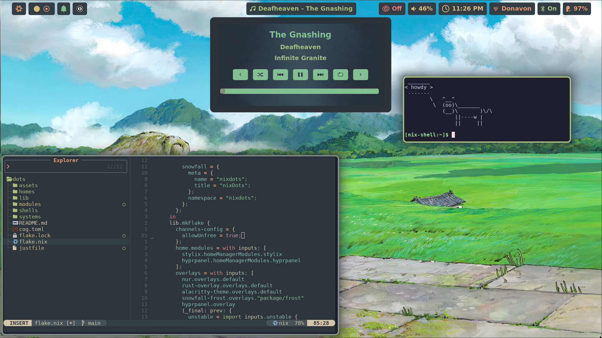
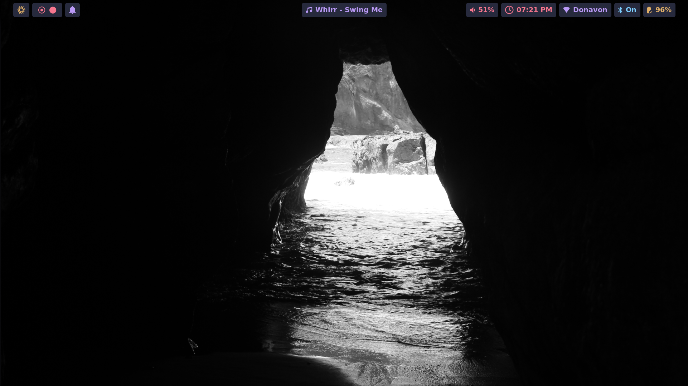

# nixos-dots

<p align="center">
    <a href="https://wiki.nixos.org/wiki/Flakes" target="_blank">
        
    </a>
    <a href="https://github.com/tommy-donavon/nixos-dots/actions/workflows/analysis.yml">
        
    </a>
    <a href="https://github.com/tommy-donavon/nixos-dots/commits">
    
    </a>
</p>

## Overview

This repository contains my personal Nix configs, managed using [flake-parts](https://flake.parts/), which provides a structured approach to organizing NixOS and macOS system configurations across multiple machines.

## Table of Contents

1. [Features](#features)
2. [Getting Started](#getting-started)
3. [Project Structure](#project-structure)
4. [Resources](#resources)
5. [Acknowledgements](#acknowledgements)
6. [Screenshots](#screenshots)

## Features

- Cross-platform configuration support (NixOS and macOS)
- Reproducible and declarative system setup
- Custom modules and home configurations

## Getting Started

### Prerequisites

- [Nix](https://nixos.org/download.html)
- [Nix-Darwin](https://github.com/LnL7/nix-darwin/tree/master) if using macOS

### Installation

```bash
git clone git@github.com:tommy-donavon/nixos-dots.git ~/dots
cd ~/dots

# Linux
sudo nixos-rebuild switch --flake .

# macOS
darwin-rebuild switch --flake .

# using nh (recommended)
nh os switch . --ask     # linux
nh darwin switch . --ask # macOS
```

## Project Structure

```
.
├── assets         # static misc files
├── home           # home manager configurations
├── modules
│   ├── darwin     # darwin specific configurations
│   ├── flake      # configuration for this flake
│   ├── home       # home manager modules
│   ├── nixos      # nixos specific configurations
│   └── shared     # shared system configurations
└── systems        # system specific configurations
```

## Acknowledgements

Other user configurations that I used and referenced

- [isabelroses/dotfiles](https://github.com/isabelroses/dotfiles) main reference for project structure
- [khaneliman/khanelinix](https://github.com/khaneliman/khanelinix)
- [JakeHamilton/config](https://github.com/jakehamilton/config)

## Screenshots




