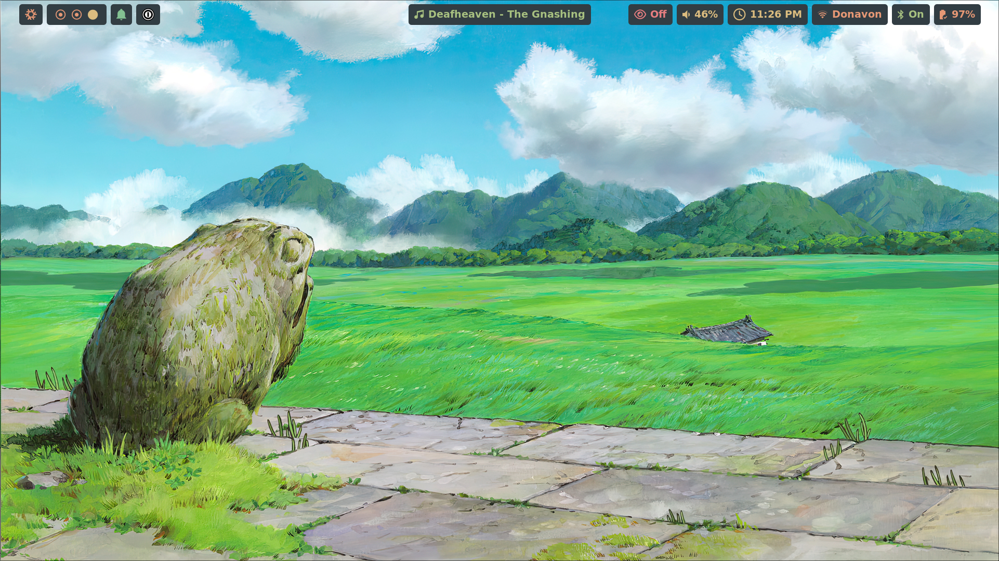

# nixos-dots

<p align="center">
    <a href="https://wiki.nixos.org/wiki/Flakes" target="_blank">
        
    </a>
    <a href="https://github.com/snowfallorg/lib" target="_blank">
        
    </a>
    <a href="https://tommy-donavon.github.io/nixos-dots/" target="_blank">
        
        </a>
    <a href="" target="_blank" src="https://img.shields.io/github/actions/workflow/status/tommy-donavon/nixos-dots/analysis.yml"></a>
    <a href="https://github.com/tommy-donavon/nixos-dots/actions/workflows/analysis.yml">
        
    </a>
</p>

## Overview

This repository contains my personal Nix configs, managed using the Snowfall library, which provides a structured approach to organizing NixOS and macOS system configurations across multiple machines.

## Table of Contents

1. [Features](#features)
2. [Getting Started](#getting-started)
3. [Project Structure](#project-structure)
4. [Resources](#resources)
5. [Acknowledgements](#acknowledgements)
6. [Screenshots](#screenshots)

## Features

- Cross-platform configuration support (NixOS and macOS)
- Modular system configuration using Snowfall library
- Reproducible and declarative system setup
- Custom modules and home configurations

## Getting Started

### Prerequisites

- [Nix](https://nixos.org/download.html)
- [Nix-Darwin](https://github.com/LnL7/nix-darwin/tree/master) if using macOS

### Installation

```bash
git clone git@github.com:tommy-donavon/nixos-dots.git ~/dots
cd ~/dots

# Linux
sudo nixos-rebuild switch --flake .

# macOS
darwin-rebuild switch --flake .

# snowfallorg/flake installed via direnv
flake switch
```

## Project Structure

```
.
├── homes          # user specific configuration
├── lib            # custom functions to merge into lib
├── modules
│   ├── darwin     # macOS specific configurations
│   ├── home       # cross platform Home Manager configurations
│   ├── nixos      # NixOS specific configurations
│   └── shared
├── shells         # exposed development shells
└── systems        # system specific configuration
```

## Resources

- [Snowfall Lib](https://github.com/snowfallorg/lib)

## Acknowledgements

Other user configurations that I used and referenced

- [khaneliman/khanelinix](https://github.com/khaneliman/khanelinix) My main reference material and inspiration
- [JakeHamilton/config](https://github.com/jakehamilton/config)

## Screenshots



